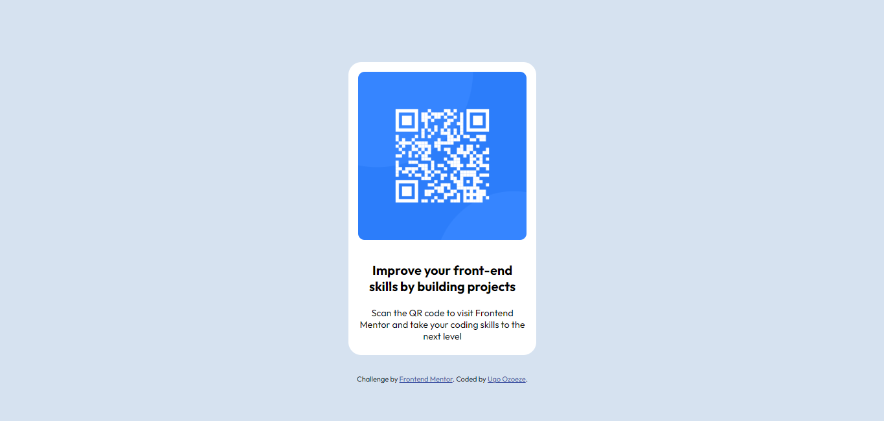

# Frontend Mentor - QR code component solution

This is a solution to the [QR code component challenge on Frontend Mentor](https://www.frontendmentor.io/challenges/qr-code-component-iux_sIO_H). Frontend Mentor challenges help you improve your coding skills by building realistic projects. 

## Table of contents

- [Overview](#overview)
  - [Screenshot](#screenshot)
  - [Links](#links)
  - [Built with](#built-with)
  - [What I learned](#what-i-learned)
  - [Continued development](#continued-development)
- [Author](#author)

## Overview
This Repo contains a QR Code Component made with HTML and CSS

### Screenshot

### Links

- Solution URL: https://www.frontendmentor.io/solutions/qr-code-component-using-css-flexbox-Qpn0hd_Uww
- Live Site URL: https://qrcomponent-ugo.netlify.app

### Built with

- Semantic HTML5 markup
- CSS custom properties
- Flexbox

### What I learned
I improved my knowledge of CSS Flexbox and Media Queries

### Continued development
I plan to read and further understand how to make sites responsive using media queries

## Author

- Website - [Ozoeze Ugo Nwando](https://www.your-site.com)
- Frontend Mentor - [@Ugonadia](https://www.frontendmentor.io/profile/Ugonadia)
- Twitter - [@_justugo](https://www.twitter.com/_justugo)

